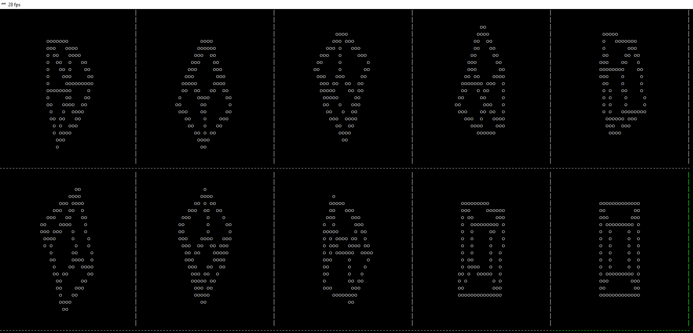

<h1 align="center">
   
  
   
  MultiCube
   
</h1>

<h4 align="center">A small C# application to display multiple 3D-Cubes in a cmd window, based on <a href="https://github.com/filthycoding/RotatingCube">a previous project of mine</a></h4>

  
  
  
  
  

  <a href="#controls">Controls</a> •
  <a href="#download">Download</a> •
  <a href="#screenshot">Screenshot</a> •
  <a href="#license">License</a> •
  <a href="#credits">Credits</a>

## Controls

Switch between the 10 screens using the number keys on your numpad or top row.  
Use **W**, **A**, **S**, **D**, **J** and **K** to rotate the cube in the selected screen manually.  
Press **ALT** at the same time to speed up the manual rotation, **SHIFT** to slow it down.  
Press **M** to toggle auto-rotation mode for a cube.  
Manual control will be disabled for that screen, but you can press **M** again to regain control.  
Press **R** to reset the currently selected cube. This will also disable auto-rotation mode for it.  
Press **ESC** at any time to exit the program.  
Press the **.** (period, dot) key to open a new instance of the program and end the current one (basically a restart, but not technically)

## Download

Either [download the source directly](https://github.com/filthycoding/MultiCube/archive/master.zip) and then open the project in Microsoft Visual Studio, or just grab a pre-built binary file from the [releases](https://github.com/filthycoding/MultiCube/releases) page!

## Screenshot

## License

[Click here to to view the license](https://github.com/filthycoding/MultiCube/blob/master/LICENSE)

## Credits
Thank you [@Skayo](https://github.com/Skayo) for making a proper README and an icon for the project!
