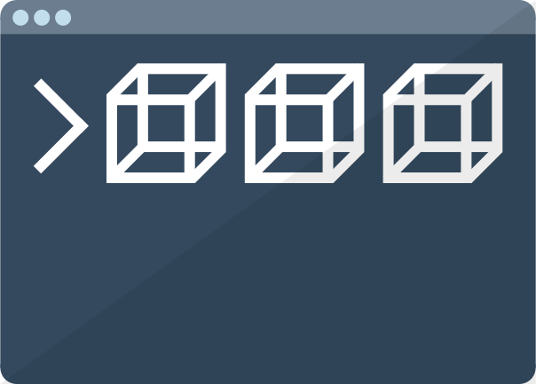

# MultiCube

A small C# console application to display multiple cubes in windows, based on <a href="https://github.com/filthycoding/RotatingCube">a previous project of mine</a>

## Controls

Switch between the 10 screens using the number keys on your numpad or top row.  
Use **W**, **A**, **S**, **D**, **J** and **K** to rotate the cube in the selected screen manually.  
Press **ALT** at the same time to speed up the manual rotation, **SHIFT** to slow it down.  
Press **M** to toggle auto-rotation mode for a cube.  
Manual control will be disabled for that screen, but you can press **M** again to regain control.  
Press **R** to reset the currently selected cube. This will also disable auto-rotation mode for it.  
Press **ESC** at any time to exit the program.  
Press the **.** (period, dot) key to open a new instance of the program and end the current one (basically a restart, but not technically)

## Download

Either download the source directly and then open the project in Microsoft Visual Studio, or just grab a pre-built binary file from the [releases](https://github.com/filthycoding/MultiCube/releases) page!

## License

[Click here to to view the license](https://github.com/filthycoding/MultiCube/blob/master/LICENSE)

## Credits
Thank you @Skayo for making a proper README and an icon for the project!
